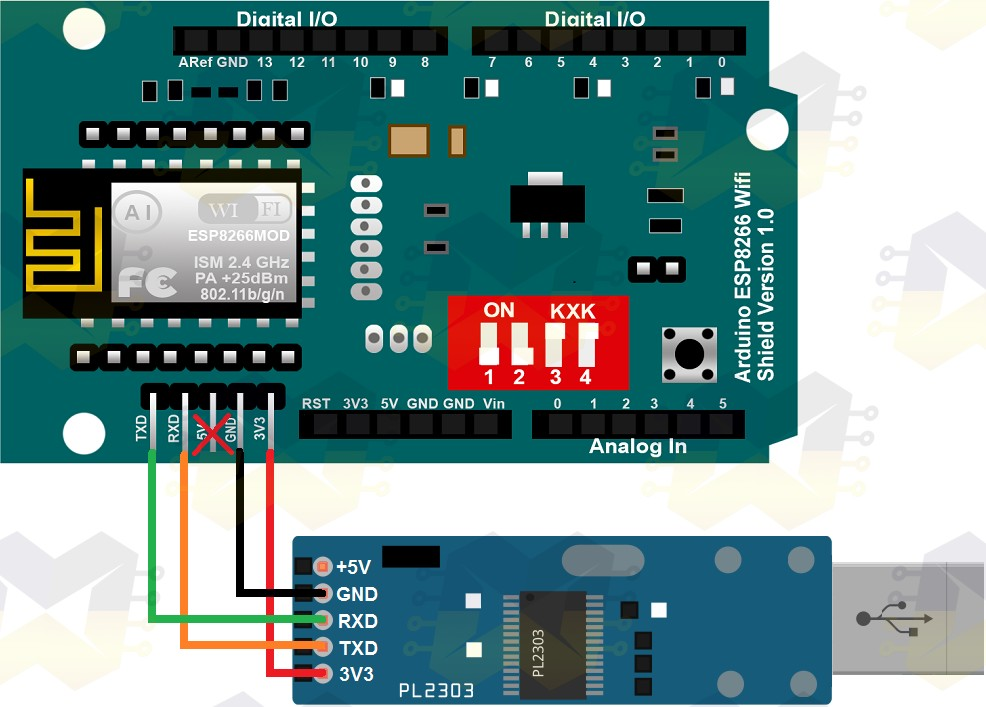
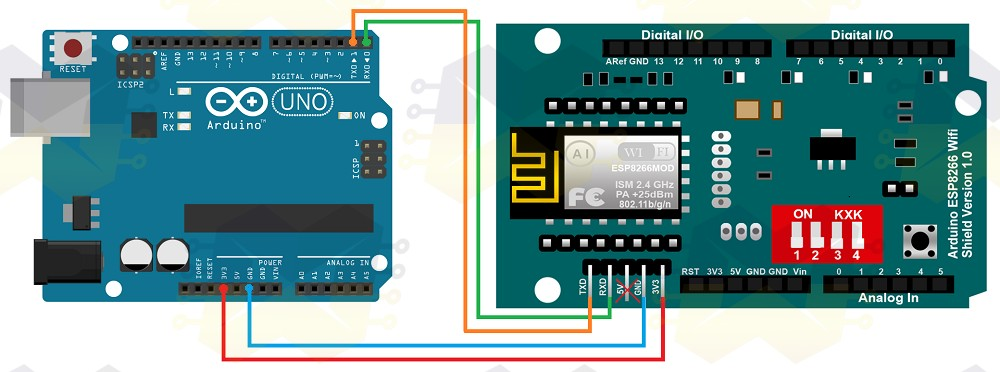

# Esp8266 Wifi Traffic Light 

This project is a sample of a webserver with micro-python and the esp8266. This webserver receive a get request and send data through the serial port to arduino to turn on or turn off a specific light color.


## Components

- [USB Adapter Serial Cp2102](https://lista.mercadolivre.com.br/adaptador-usb-serial-ttl-conversor-cp2102#D[A:Adaptador%20Usb%20Serial%20Ttl%20Conversor%20Cp2102])
- [ESP8266](https://lista.mercadolivre.com.br/esp8266#D[A:esp8266])
- [Male Jumpers x Female](https://lista.mercadolivre.com.br/jumpers-macho-macho#D[A:jumpers%20macho%20macho])
- [Female Jumpers x Female](https://lista.mercadolivre.com.br/jumper-femea-femea#D[A:jumper%20femea%20femea])
- [Traffic Light Module 8 mm](https://lista.mercadolivre.com.br/modulo-sem%C3%A1foro-8mm#D[A:modulo%20sem%C3%A1foro%208mm])

## Drivers

- [CP210x USB to UART](https://medium.com/r/?url=https%3A%2F%2Fwww.silabs.com%2Fdocuments%2Fpublic%2Fsoftware%2FMac_OSX_VCP_Driver.zip)


## Micropython

- [Micropython Firmwares](http://micropython.org/download#esp8266)

## Circuit Connection

#### Flash Connection



#### Arduíno X ESP8266 Connection



<br>
<br>

>Images are from MasterWalk.

## Install Dependencies

```
$ pipenv install
```

## Starting Project

1. Download and flashing your micro-python firmware.
2. Set your ssid and password in the boot.py file.
3. You can change the port of connection in the main.py
4. Send lib, boot.py and main.py to esp8266. 
5. Send your [sketch](https://github.com/menezes-ssz/sketch_traffic_ligths) to arduíno.
6. Make connection between arduíno and esp8266.
7. Choose your own output pins in arduíno and have fun!

## Docs and Plugins

- http://docs.micropython.org/en/latest/
- https://github.com/espressif/esptool
- https://plugins.jetbrains.com/plugin/9777-micropython
- https://www.arduino.cc/reference/en


